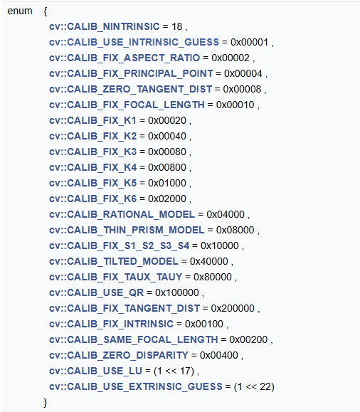
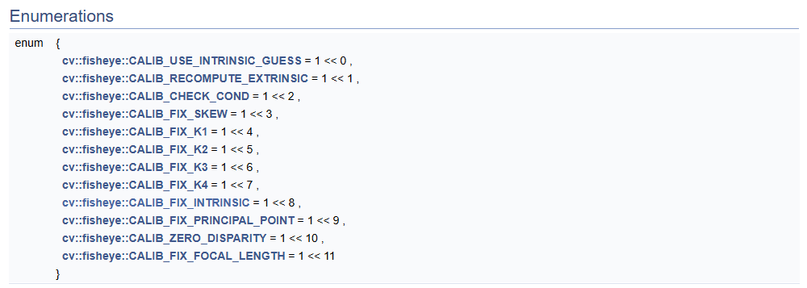

### 1.简介
本次的代码主要用于相机的标定，其中包括
* 单目:针孔相机，鱼眼相机
* 双目:针孔相机，鱼眼相机

安装依赖
```bash
conda create -n calib python=3.10
pip install -r requirements.txt
```


### 2.一些说明
#### 2.1 数据集
* 单目

```txt
- calib
    - xxx1.png
    - xxx2.jpg
    ...
```

* 双目
```
- calib
    - left
        - xxx1.png
        - xxx2.jpg
        ...
    - right
        - xxx1.png
        - xxx2.jpg
        ...
```


#### 2.2 配置文件
采用yaml文件来配置路径和相机型号这些参数
* root_dir: 标定图像的目录,目录下就是图像
    * 单目：该目录路径下直接就是标定图像
    * 双目：该目录路径下，还有两个目录left和right，分别装左右相机的标定图像
* Camera_SensorType：相机传感器类型，支持 Pinhole, Fisheye
* Camera_NumType：相机数量，支持 Monocular, Stereo
* square_size：两个相邻标定点之间的距离，比如每格边长 0.02m
* board_size：棋盘格规格，为 [7,6] 类似
* board_type：标定点类型，支持 Corner 或 Circle
* raduis_size：亚角点查找半径
* criteria：终止条件设置，cv2.TERM_CRITERIA_EPS + cv2.TERM_CRITERIA_MAX_ITER
* flag：标定标志位（opencv 标志组合）
* alpha: **双目针孔专用**，像素有效因子，[0,1]， 0 表示只有有效的像素，则是全部像素都保存。
* save_dir：保存目录，会在该目录下保存内参、外参、角点文件、世界点文件
* use_csv_data：是否使用CSV数据而非从图像检测角点
* image_points_dir：在use_csv_data为true的情况下，读取的角点目录
    * 单目：在该文件夹下有corners文件夹，会从corners文件夹里面读取多张图像的多个csv文件。
    * 双目: 在该文件夹下有left_corners和right_corners文件夹，会从left_corners和right_corners分别读取左右图像的多个csv文件。
* world_points_file: 世界坐标点CSV文件路径，只需要一份就可以了

例如
* 单目（不使用csv）
```yaml
root_dir: data/corner/left      # 标定图像的目录,目录下就是图像
Camera_SensorType: Pinhole      # 支持: Pinhole, Fisheye, Omnidir
Camera_NumType: Monocular       # 支持: Monocular, Stereo
square_size: 0.02               # 单位距离，比如每格边长 m
board_size: [9, 6]              # 棋盘格规格: 行数7, 列数6
board_type: Corner              # 支持: Corner 或 Circle
raduis_size: [5, 5] 
criteria: [3, 100, 1e-7]        # 终止条件: cv2.TERM_CRITERIA_EPS + cv2.TERM_CRITERIA_MAX_ITER
flag: 0                         # 标定标志位（opencv 标志组合）
save_dir: ./output

#  CSV数据加载选项
use_csv_data: false            # 是否使用CSV数据而非从图像检测角点
image_points_dir: None       # 单目：图像角点CSV文件目录，会在该文件夹下创建一个corners文件，之后保存在output/corners里。
world_points_file: None # 世界坐标点CSV文件
```
* 单目（使用csv）
```yaml
root_dir: data/corner/left      # 标定图像的目录,目录下就是图像
Camera_SensorType: Pinhole      # 支持: Pinhole, Fisheye, Omnidir
Camera_NumType: Monocular       # 支持: Monocular, Stereo
square_size: 0.02               # 单位距离，比如每格边长 m
board_size: [9, 6]              # 棋盘格规格: 行数7, 列数6
board_type: Corner              # 支持: Corner 或 Circle
raduis_size: [5, 5] 
criteria: [3, 100, 1e-7]        # 终止条件: cv2.TERM_CRITERIA_EPS + cv2.TERM_CRITERIA_MAX_ITER
flag: 0                         # 标定标志位（opencv 标志组合）
save_dir: ./output

#  CSV数据加载选项
use_csv_data: true            # 是否使用CSV数据而非从图像检测角点
image_points_dir: output       # 单目：图像角点CSV文件目录，会在该文件夹下创建一个corners文件，之后保存在output/corners里。
world_points_file: output/world_coordinates.csv # 世界坐标点CSV文件
```

* 双目（不使用csv）

```yaml
root_dir: data/corner/left      # 标定图像的目录,目录下就是图像
Camera_SensorType: Pinhole      # 支持: Pinhole, Fisheye, Omnidir
Camera_NumType: Stereo          # 支持: Monocular, Stereo
square_size: 0.02               # 单位距离，比如每格边长 m
board_size: [9, 6]              # 棋盘格规格: 行数7, 列数6
board_type: Corner              # 支持: Corner 或 Circle
raduis_size: [5, 5] 
criteria: [3, 100, 1e-7]        # 终止条件: cv2.TERM_CRITERIA_EPS + cv2.TERM_CRITERIA_MAX_ITER
flag: 0                         # 标定标志位（opencv 标志组合）
save_dir: ./output

#  CSV数据加载选项
use_csv_data: false            # 是否使用CSV数据而非从图像检测角点
image_points_dir: None       # 单目：图像角点CSV文件目录，会在该文件夹下创建一个corners文件，之后保存在output/corners里。
world_points_file: None # 世界坐标点CSV文件
```

* 双目（使用csv）
```yaml
root_dir: data/corner/left      # 标定图像的目录,目录下就是图像
Camera_SensorType: Pinhole      # 支持: Pinhole, Fisheye, Omnidir
Camera_NumType: Stereo       # 支持: Monocular, Stereo
square_size: 0.02               # 单位距离，比如每格边长 m
board_size: [9, 6]              # 棋盘格规格: 行数7, 列数6
board_type: Corner              # 支持: Corner 或 Circle
raduis_size: [5, 5] 
criteria: [3, 100, 1e-7]        # 终止条件: cv2.TERM_CRITERIA_EPS + cv2.TERM_CRITERIA_MAX_ITER
flag: 0                         # 标定标志位（opencv 标志组合）
save_dir: ./output

#  CSV数据加载选项
use_csv_data: true            # 是否使用CSV数据而非从图像检测角点
image_points_dir: output       # 单目：图像角点CSV文件目录，会在该文件夹下创建一个corners文件，之后保存在output/corners里。
world_points_file: output/world_coordinates.csv # 世界坐标点CSV文件
```


### 3.保存的说明

保存目录的补充说明：
* 单目保存
```
- ${save_dir}
    - corners # 角点目录
        - xxx.csv
        - ...
    - param.yaml # 参数
    - pose.txt # 位姿
    - world_points_file.csv 世界点
```
* 双目保存
```
- ${save_dir}
    - left_corners # 左角点目录
        - xxx.csv
        - ...
    - right_corners # 右角点目录
        - xxx.csv
        - ...
    - param.yaml # 参数
    - left_pose.txt # 位姿
    - right_pose.txt
    - world_points_file.csv 世界点
```


解释：单目被保存的的参数有
* param.yaml
    * Camera_SensorType：相机传感器类型
    * Camera_NumType：相机数量类型
    * K：相机内参矩阵
    * D：相机畸变参数
    * height：图像的行数
    * width：图像的列数
* pose.txt：棋盘格位姿的txt文件
* corners ： 保存角点的文件夹
* world_coordinates.csv ： 世界点csv文件路径


双目保存的参数：

* param.yaml
    * Camera_SensorType：相机传感器类型
    * Camera_NumType：相机数量类型
    * K_l：左相机内参矩阵
    * D_l：左相机畸变参数
    * K_r：右相机内参矩阵
    * D_r：右相机畸变参数
    * R：旋转矩阵
    * t：平移向量
    * height：图像的行数
    * width：图像的列数
* left_pose.txt：棋盘格位姿的txt文件
* right_pose.txt：棋盘格位姿的txt文件
* left_corners ： 保存左目角点的文件夹
* right_corners ： 保存右目角点的文件夹
* world_coordinates.csv ： 世界点csv文件路径


### 4.使用

关于配置文件，请参考config文件，自行修改。使用标定工具，直接终端运行即可
```shell
## 单目
python main.py -c ${config_path}
```
可以使用 `-h` 选项查看命令行参数
```shell
python main.py -h
```


### 附录1 - flag 说明

* Pinhole 参考 https://docs.opencv.org/4.x/d9/d0c/group__calib3d.html#gga64299f9f4e4da0dd0fda5a2fff388927a6eedf3c8312d4b29edfe0a434722e2ef



* Fisheye 参考




### 附录2 - 标定点辅助

* matlab : 见[matlabtool](./boarddettools/matlabtool/README.md)。
* discocal : 见[discocal](./boarddettools/discocal/README.md)。