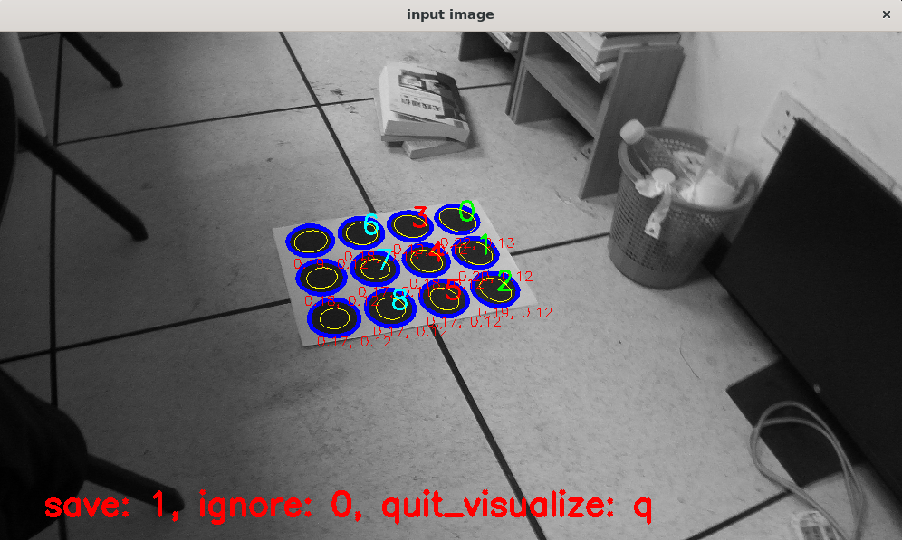
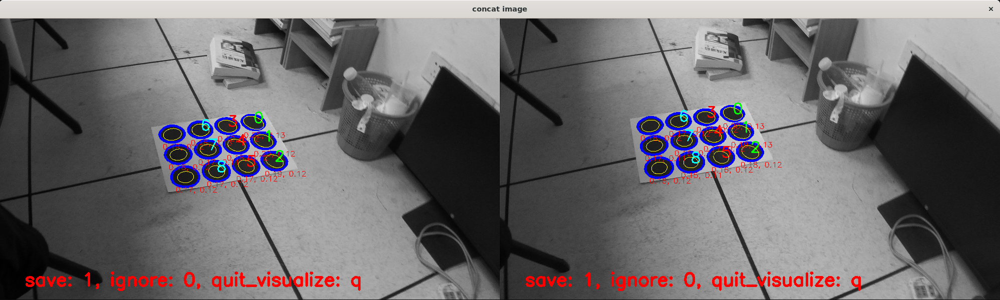

### 1.说明
由于有时候opencv的角点检测过于差，并且又因为本库支持角点、世界点导出csv文件，以及csv读入，所以这里用discocal检测圆心。

附注: ${data} 表示 data 的值，是一种泛化的表示。

### 2.环境编译
* WSL Ubuntu 20.04
* i5 12600

该环境依赖 
* OpenCV
* Eigen
* openmp

你可以用命令编译
```bash
cmake -S . -B build
cmake --build ./build -j 4
```
或者
```bash
mkdir build && cd build
cmake ..
make -j 4
```


### 3.使用方法
#### 3.1 单目
首先你要有一个项目目录，如下单目目录
```txt
- ${datadir}
    - calib
        - xxxx1.png
        - xxxx2.png
        - ...
```
之后修改 `demomono.sh`
```bash
root_dir=${datadir}/calib
output_dir=./output
nx=3
ny=4
./build/main_detect ${root_dir} ${output_dir} ${nx} ${ny}
```
其中
* root_dir    标定目录
* output_dir  输出目录
* nx          横轴圆心数
* ny          纵轴圆心数

之后运行
```bash
bash demomono.sh
```
效果如下图



#### 3.2 双目
首先你要有一个项目目录，如下双目目录
```txt
- ${datadir}
    - calib
        - left
            - xxxx1.png
            - xxxx2.png
            - ...
        - right
            - xxxx1.png
            - xxxx2.png
            - ...
```
之后修改 `demo.sh`
```bash
root_dir=${datadir}/calib
output_dir=./output
nx=3
ny=4
./build/main_detect ${root_dir} ${output_dir} ${nx} ${ny}
```
其中
* root_dir    标定目录
* output_dir  输出目录
* nx          横轴圆心数
* ny          纵轴圆心数

之后运行
```bash
bash demostereo.sh
```
效果如下图



### 4.结果
#### 4.1 单目
当你运行完程序以后，会在${output_dir}文件夹下，通过保存为csv文件保存检测的标定点，在
```txt
- ${output_dir}
    - xxx1.csv
    - xxx2.csv
    ...
```
csv格式如下
```csv
image_x image_y
696.889513 320.479451
929.560063 308.360512
1159.486585 298.711243
1381.371946 290.670700
704.377344 551.411479
942.024712 539.217910
1177.165306 527.326669
1403.249071 515.654631
713.128898 790.292498
953.670361 778.165431
1191.527169 764.067472
1419.988890 748.135263
```

#### 4.2 双目
双目和单目保存时相似的，如下
```txt
- ${output_dir}
    - left_corners
        - xxx1.csv
        - xxx2.csv
        ...
    - right_corners
        - xxx1.csv
        - xxx2.csv
        ...
```
这里会分别保存两个相机的标定点。

#### 4.3 世界点生成
为了更加自由的生成世界点，那么采用worldboardgen程序进行保存，使用命令如下
```bash
./build/worldboardgen --nx ${nx} --ny ${ny} --square-size ${s}
```
其中nx和ny和之前的参数一致，而square-size则是你圆心之间的距离(单位为m)。示例程序
```bash
./build/worldboardgen --nx 4 --ny 3 --square-size 0.5
```
结果csv文件路径为`${output_dir}/world_coordinates.csv`，内容如下
```csv
world_x world_y world_z
0.000000 0.000000 0.000000
0.500000 0.000000 0.000000
1.000000 0.000000 0.000000
1.500000 0.000000 0.000000
0.000000 0.500000 0.000000
0.500000 0.500000 0.000000
1.000000 0.500000 0.000000
1.500000 0.500000 0.000000
0.000000 1.000000 0.000000
0.500000 1.000000 0.000000
1.000000 1.000000 0.000000
1.500000 1.000000 0.000000
```
